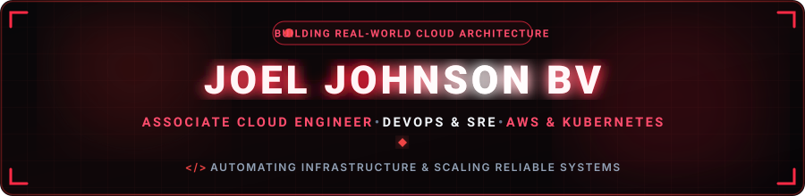
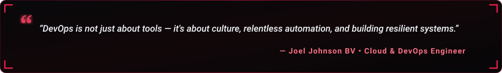

<p align="center">
  
</p>

<p align="center">
  <a href="https://welcometotheportfolio.vercel.app/" target="_blank">
    
  </a>
</p>

<!-- Social & Primary Navigation Badges -->
<p align="center">
  <a href="https://www.linkedin.com/in/joejohnson25/" target="_blank">
    
  </a>
  &nbsp;
  <a href="https://welcometotheportfolio.vercel.app/" target="_blank">
    
  </a>
  &nbsp;
  <a href="mailto:joeljohnson2504@gmail.com">
    
  </a>
  &nbsp;
  <a href="https://hub.docker.com/repositories/joeljxhnson" target="_blank">
    
  </a>
  &nbsp;
  <a href="https://github.com/jojohnoson" target="_blank">
    
  </a>
</p>

<!-- Verification & Meta Badges -->
<p align="center">
  <a href="mailto:joeljohnson2504@gmail.com?subject=Opportunity%20Discussion%20-%20Cloud%20%26%20DevOps%20Roles" target="_blank">
    
  </a>
  &nbsp;
  <a href="https://www.credly.com/badges/9b669524-39bd-4f6c-9bb1-46917cb2b568/public_url" target="_blank">
    
  </a>
  &nbsp;
  <a href="https://www.karunya.edu/" target="_blank">
    
  </a>
  &nbsp;
  <a href="https://maps.google.com/?q=Bangalore,+India" target="_blank">
    
  </a>
</p>

<!-- Profile Views Counter -->
<p align="center">
  
</p>

---

<h2 align="center">🔷 About Me &amp; Professional Summary</h2>

<p align="center">
  
</p>

<p align="center">
  
</p>

<p align="center">
  Hey! I'm <b>Joel Johnson BV</b>, an <b>Associate Cloud &amp; DevOps Engineer</b> based in Bangalore, India.<br />
  I specialize in architecting highly available, fault-tolerant cloud infrastructure, automating end-to-end CI/CD pipelines, and managing Kubernetes workloads.
</p>

> <i>"I believe in building scalable, automated, and reliable infrastructure that enables teams to ship features faster and operate with confidence. DevOps is not just about tools — it's about culture, automation, and continuous improvement."</i>

- 🔭 **Industry Experience**: Cloud Intern alumnus at **F13 Technologies** (06/2025 – 07/2025) — provisioned core AWS resources with Terraform (cutting config time by **37%**) and automated routine ops in Python (reducing toil by **92%**).
- ☁️ **Cloud & Infrastructure**: Hands-on expertise architecting fault-tolerant **AWS Multi-AZ deployments** using Terraform IaC and managing production-grade **Amazon EKS** workloads using **Helm** and **ArgoCD**.
- 🚀 **Automation & CI/CD**: Engineered end-to-end CI/CD pipelines in **Jenkins** enabling zero-downtime deployments and **90% faster release cycles**.
- 🔬 **Published Research**: Author in **IEEE (2025)** on deep learning vision models for gastrointestinal endoscopic disease prediction.
- 🎯 **Current Focus**: Kubernetes orchestration, GitOps workflows, automated self-healing infrastructure, and cloud security observability.

---

<h2 align="center">⚡ Quick Overview</h2>

```yaml
name: Joel Johnson BV
roles:
  - Associate Cloud Engineer
  - Junior DevOps Engineer
  - Site Reliability Engineer (SRE)
education:
  degree: B.Tech in Computer Science & Engineering (Specialization in AI)
  institution: Karunya Institute of Technology and Sciences, Coimbatore
  graduation: 2026
experience:
  recent: Cloud Intern @ F13 Technologies (06/2025 - 07/2025)
location: Bangalore, India
core_focus:
  - Infrastructure as Code (Terraform)
  - Cloud Architecture (AWS Multi-AZ, EKS)
  - CI/CD Automation & GitOps (Jenkins, Docker, Helm, ArgoCD)
  - Reliability & SRE (ALB/ASG Self-Healing, Prometheus, Grafana)
seeking: Full-time Associate Cloud / DevOps Engineer Roles & Infrastructure Consulting
```

---

<h2 align="center">🛠️ Technical Skills &amp; Tech Stack</h2>

<p align="center"><b>Cloud, Containers &amp; Orchestration</b></p>
<p align="center">
  <a href="https://skillicons.dev">
    
  </a>
</p>

<p align="center"><b>CI/CD, Monitoring &amp; Security Tools</b></p>
<p align="center">
  <a href="https://skillicons.dev">
    
  </a>
  &nbsp;&nbsp;
  <a href="https://helm.sh" target="_blank">
    
  </a>
</p>

<p align="center"><b>Programming, Frameworks &amp; Databases</b></p>
<p align="center">
  <a href="https://skillicons.dev">
    
  </a>
</p>

<br/>

<table align="center" width="100%">
  <tr>
    <td align="left" width="25%"><strong>☁️ Cloud &amp; IaC</strong></td>
    <td align="left">
      
      
      
      
      
      
      
      
      
      
    </td>
  </tr>
  <tr>
    <td align="left" width="25%"><strong>⚙️ DevOps &amp; Containers</strong></td>
    <td align="left">
      
      
      
      
      
      
      
      
    </td>
  </tr>
  <tr>
    <td align="left" width="25%"><strong>🛡️ Security &amp; Observability</strong></td>
    <td align="left">
      
      
      
      
      
      
    </td>
  </tr>
  <tr>
    <td align="left" width="25%"><strong>💻 Languages &amp; Web</strong></td>
    <td align="left">
      
      
      
      
      
      
      
      
    </td>
  </tr>
</table>

---

<h2 align="center">🌟 Featured Project Spotlight</h2>

<table width="100%" border="0" align="center">
  <tr>
    <td width="65%" style="padding: 16px;">
      <h3>🏗️ Event Register Infrastructure (Self-Healing AWS Architecture)</h3>
      <p>
        Production-grade <strong>Infrastructure as Code (IaC)</strong> and automated <strong>CI/CD pipeline</strong> built on AWS multi-AZ environment using <strong>Terraform</strong> and <strong>Jenkins</strong>.
      </p>
      <ul>
        <li>Configured <strong>Application Load Balancers (ALB)</strong> and <strong>Auto Scaling Groups (ASG)</strong> for high availability and automated failover.</li>
        <li>Achieved <strong>100% automated self-healing</strong>: simulated EC2 instance crash tests triggered automated instance replacement with zero manual intervention.</li>
        <li>Integrated automated testing, Docker containerization, and continuous delivery via Jenkins.</li>
      </ul>
      <p>
        <a href="https://github.com/jojohnoson/Event-Register-Infra" target="_blank">
          
        </a>
        &nbsp;&nbsp;
        <a href="https://www.linkedin.com/posts/joejohnson25_aws-terraform-devops-activity-7462949469379084289-1z6j?utm_source=share&utm_medium=member_desktop&rcm=ACoAAD94cbUBd_JDlWggYfjL38ni6NPTo80GIfc" target="_blank">
          
        </a>
      </p>
    </td>
    <td width="35%" align="center" style="padding: 16px;">
      <br/><br/>
      <br/><br/>
      
    </td>
  </tr>
</table>

<br/>

<table width="100%" border="0" align="center">
  <tr>
    <td width="65%" style="padding: 16px;">
      <h3>🎟️ Event Register App (Cloud-Native Event Platform)</h3>
      <p>
        Full-stack modern <strong>Event Registration &amp; Ticketing Platform</strong> built with <strong>Next.js</strong>, <strong>TypeScript</strong>, and <strong>Docker</strong> — enabling users to acquire bespoke credentials and reserve priority track admissions.
      </p>
      <ul>
        <li>Engineered with <strong>Next.js App Router</strong>, <strong>React</strong>, and <strong>Tailwind CSS</strong> for responsive, high-performance UI and seamless event booking.</li>
        <li>Fully containerized using <strong>Docker</strong> for environment parity and deployed continuously with automated CI/CD on <strong>Vercel</strong>.</li>
        <li>Integrated modular component architecture with client/server validation, robust state management, and end-to-end type safety.</li>
      </ul>
      <p>
        <a href="https://github.com/jojohnoson/Event-Register-App" target="_blank">
          
        </a>
        &nbsp;&nbsp;
        <a href="https://eventhubmanagementapp.vercel.app/events" target="_blank">
          
        </a>
      </p>
    </td>
    <td width="35%" align="center" style="padding: 16px;">
      <br/><br/>
      <br/><br/>
      
    </td>
  </tr>
</table>

---

<h2 align="center">🚀 Key Projects &amp; Deployments</h2>

<table width="100%">
  <thead>
    <tr>
      <th>Project</th>
      <th>Key Highlights &amp; Impact</th>
      <th>Tech Stack</th>
      <th>Links</th>
    </tr>
  </thead>
  <tbody>
    <tr>
      <td><strong>🌐 Three-Tier EKS GitOps Deployment</strong></td>
      <td>
        • Managed secure production-grade <strong>Amazon EKS</strong> clusters.<br/>
        • Implemented GitOps Continuous Delivery using <strong>Helm &amp; ArgoCD</strong>.<br/>
        • Configured automated Slack alerts for instant deployment observability.
      </td>
      <td><code>Kubernetes</code> <code>EKS</code> <code>Helm</code> <code>ArgoCD</code> <code>Jenkins</code></td>
      <td>
        <a href="https://github.com/jojohnoson/3-tier-Application-Deployment-Production-Grade-" target="_blank">
          
        </a>
      </td>
    </tr>
    <tr>
      <td><strong>⚡ RegisterApp Automated CI/CD Pipeline</strong></td>
      <td>
        • Engineered end-to-end automated Jenkins &amp; Docker CI/CD pipeline for Java apps.<br/>
        • Enabled zero-downtime rolling deployments and automated rollbacks via single Git push.<br/>
        • <strong>Reduced manual deployment time by 90%</strong>.
      </td>
      <td><code>Jenkins</code> <code>Docker</code> <code>Java</code> <code>AWS</code> <code>Git</code></td>
      <td>
        <a href="https://www.linkedin.com/posts/joejohnson25_devops-ciabrcd-jenkins-activity-7498104193828724736-p1uY?utm_source=share&utm_medium=member_desktop&rcm=ACoAAD94cbUBd_JDlWggYfjL38ni6NPTo80GIfc" target="_blank">
          
        </a>
        <a href="https://github.com/jojohnoson" target="_blank">
          
        </a>
      </td>
    </tr>
    <tr>
      <td><strong>💻 Modern Developer Portfolio</strong></td>
      <td>
        • High-performance, SEO-optimized personal portfolio showcasing projects, experience, and contact channels.<br/>
        • Clean responsive UI built with modern web principles.
      </td>
      <td><code>React</code> <code>Tailwind CSS</code> <code>JavaScript</code> <code>Vercel</code></td>
      <td>
        <a href="https://welcometotheportfolio.vercel.app/" target="_blank">
          
        </a>
        <a href="https://github.com/jojohnoson" target="_blank">
          
        </a>
      </td>
    </tr>
    <tr>
      <td><strong>🔬 Deep Learning Gastrointestinal Disease Prediction</strong></td>
      <td>
        • Engineered an advanced deep learning computer vision model for endoscopic disease classification.<br/>
        • Published in <strong>IEEE (2025)</strong>: <em>Endoscopic Image-Based Deep Learning Approach for Predicting Gastrointestinal Diseases</em>.
      </td>
      <td><code>Python</code> <code>Deep Learning</code> <code>Computer Vision</code> <code>IEEE</code></td>
      <td>
        <a href="https://ieeexplore.ieee.org/abstract/document/11382902" target="_blank">
          
        </a>
        <a href="https://github.com/jojohnoson" target="_blank">
          
        </a>
      </td>
    </tr>
  </tbody>
</table>

---

<h2 align="center">📜 Certifications &amp; Publications</h2>

<div align="center">

| Category | Certificate / Publication Title | Issuing Body | Verification Link |
|:---:|:---|:---|:---:|
| ☁️ | **AWS Cloud Quest: Cloud Practitioner (Partial Certified)** | Amazon Web Services (AWS) | [**Verify Credly**](https://www.credly.com/badges/9b669524-39bd-4f6c-9bb1-46917cb2b568/public_url) |
| 🐧 | **Linux Essentials Badge** | Linux Foundation | [**Verify Credly**](https://www.credly.com/badges/be71d690-04d2-4707-9954-1c5c5f03b96e/public_url) |
| 🌐 | **Cloud Computing Certification** | NPTEL | [**View Certificate**](https://archive.nptel.ac.in/content/noc/NOC24/SEM2/Ecertificates/106/noc24-cs118/Course/NPTEL24CS118S15240234804069928.pdf) |
| 🔌 | **Computer Networking** | CISCO | [**View Credential**](https://www.linkedin.com/posts/joejohnson25_cisco-networking-careergrowth-activity-7219338029851717632-fWts?utm_source=share&utm_medium=member_desktop&rcm=ACoAAD94cbUBd_JDlWggYfjL38ni6NPTo80GIfc) |
| 💻 | **Full-Stack Web Development** | Internshala | [**View Credential**](https://www.linkedin.com/posts/joejohnson25_webdevelopment-internship-careergrowth-activity-7219336917622960128-5d4I?utm_source=share&utm_medium=member_desktop&rcm=ACoAAD94cbUBd_JDlWggYfjL38ni6NPTo80GIfc) |
| 📄 | **Endoscopic Image-Based Deep Learning Approach for Predicting Gastrointestinal Diseases** | **IEEE (2025)**<br/>*Joel Johnson BV &amp; Martin Victor K* | [**IEEE Xplore**](https://ieeexplore.ieee.org/abstract/document/11382902) |

</div>

---

<h2 align="center">📊 GitHub Analytics &amp; Activity</h2>

<div align="center">
  <table border="0">
    <tr>
      <td>
        
      </td>
      <td>
        
      </td>
    </tr>
    <tr>
      <td colspan="2" align="center">
        
      </td>
    </tr>
  </table>
</div>

<p align="center">
  
</p>

---

<h2 align="center">🤝 Let's Connect &amp; Collaborate</h2>

<p align="center"><i>Whether you want to discuss cloud architecture, explore open-source collaboration, or have opportunities in DevOps/SRE — my inbox is always open!</i></p>

<table border="0" align="center">
  <tr>
    <td align="center" width="220" style="padding: 16px;">
      <a href="https://www.linkedin.com/in/joejohnson25/" target="_blank">
        
        <br /><br />
        
      </a>
      <br />
      <sub><b>Professional Network</b></sub>
    </td>
    <td align="center" width="220" style="padding: 16px;">
      <a href="https://welcometotheportfolio.vercel.app/" target="_blank">
        
        <br /><br />
        
      </a>
      <br />
      <sub><b>Live Projects &amp; Work</b></sub>
    </td>
    <td align="center" width="220" style="padding: 16px;">
      <a href="mailto:joeljohnson2504@gmail.com">
        
        <br /><br />
        
      </a>
      <br />
      <sub><b>Direct Collaboration</b></sub>
    </td>
    <td align="center" width="220" style="padding: 16px;">
      <a href="https://hub.docker.com/repositories/joeljxhnson" target="_blank">
        
        <br /><br />
        
      </a>
      <br />
      <sub><b>Container Registries</b></sub>
    </td>
  </tr>
</table>

<p align="center">
  
</p>
