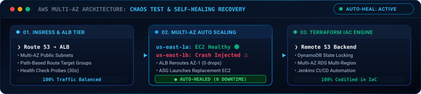
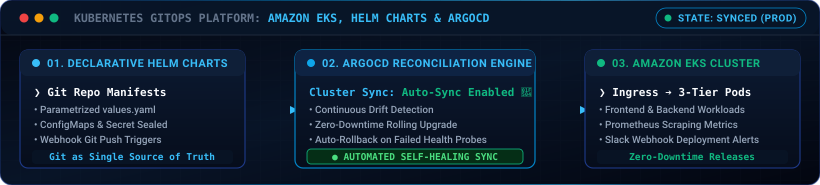
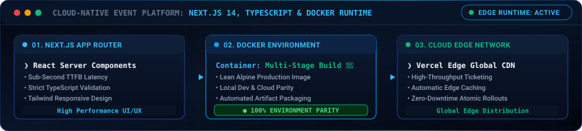

<p align="center">
  
</p>

<p align="center">
  
</p>

<!-- Social & Primary Navigation Badges -->
<p align="center">
  <a href="https://www.linkedin.com/in/joejohnson25/" target="_blank">
    
  </a>
  &nbsp;
  <a href="https://welcometotheportfolio.vercel.app/" target="_blank">
    
  </a>
  &nbsp;
  <a href="mailto:joeljohnson2504@gmail.com">
    
  </a>
  &nbsp;
  <a href="https://hub.docker.com/repositories/joeljxhnson" target="_blank">
    
  </a>
  &nbsp;
  <a href="https://github.com/jojohnoson" target="_blank">
    
  </a>
</p>

<!-- Verification & Meta Badges -->
<p align="center">
  <a href="mailto:joeljohnson2504@gmail.com?subject=Opportunity%20Discussion%20-%20Cloud%20%26%20DevOps%20Roles" target="_blank">
    
  </a>
  &nbsp;
  <a href="https://www.credly.com/badges/9b669524-39bd-4f6c-9bb1-46917cb2b568/public_url" target="_blank">
    
  </a>
  &nbsp;
  <a href="https://www.credly.com/badges/be71d690-04d2-4707-9954-1c5c5f03b96e/public_url" target="_blank">
    
  </a>
  &nbsp;
  <a href="https://www.karunya.edu/" target="_blank">
    
  </a>
  &nbsp;
  <a href="https://maps.google.com/?q=Bangalore,+India" target="_blank">
    
  </a>
</p>

<!-- Profile Views Counter -->
<p align="center">
  
</p>

---

<h2 align="center">⚡ Executive Summary &amp; Production Metrics</h2>

<p align="center">
  <b>Joel Johnson BV</b> is an <b>Associate Cloud &amp; DevOps Engineer</b> based in Bangalore, India.<br />
  Specializing in <b>AWS Multi-AZ Cloud Architecture</b>, declarative <b>Infrastructure as Code (Terraform)</b>, enterprise <b>Kubernetes GitOps (Helm &amp; ArgoCD)</b>, and automated <b>DevSecOps CI/CD pipelines</b>.
</p>

<!-- Impact Metrics Grid -->
<div align="center">
  <table border="0" width="100%">
    <tr>
      <td align="center" width="25%">
        <h3>⚡ 37%</h3>
        <b>IaC Config Reduction</b><br/>
        <sub>Terraform Modular AWS Blueprints</sub>
      </td>
      <td align="center" width="25%">
        <h3>🤖 92%</h3>
        <b>Operational Toil Eliminated</b><br/>
        <sub>Python Automation &amp; Event Handlers</sub>
      </td>
      <td align="center" width="25%">
        <h3>🚀 90%</h3>
        <b>Faster Deployments</b><br/>
        <sub>Zero-Downtime CI/CD Pipelines</sub>
      </td>
      <td align="center" width="25%">
        <h3>🛡️ 100%</h3>
        <b>Self-Healing Uptime</b><br/>
        <sub>ALB + ASG Multi-AZ Auto-Failover</sub>
      </td>
    </tr>
  </table>
</div>

<br/>

- 🔭 **Industry Track Record**: Cloud Intern alumnus at **F13 Technologies** (06/2025 – 07/2025) — provisioned core AWS resources with Terraform (cutting config time by **37%**) and automated routine operations in Python (reducing manual toil by **92%**).
- ☁️ **Cloud Infrastructure as Code**: Hands-on mastery deploying fault-tolerant **AWS Multi-AZ architectures** (VPC, EKS, ALB, ASG, RDS, S3, IAM, Route 53) using **Terraform** with remote state locking and modular blueprints.
- ☸️ **Container Orchestration & GitOps**: Production-grade **Amazon EKS** cluster configuration, containerization with **Docker**, declarative packaging via **Helm**, and automated synchronization with **ArgoCD**.
- 🔒 **DevSecOps & Shift-Left Quality Gates**: Integrated automated static code analysis via **SonarQube** and container CVE scanning via **Trivy** to block vulnerabilities before staging/production.
- 🔬 **Published IEEE Researcher (2025)**: Authored peer-reviewed research in **IEEE Xplore** on deep learning computer vision architectures for medical image disease classification.

---

<h2 align="center">🏛️ Core Architectural Directives &amp; Engineering Tenets</h2>

<table width="100%">
  <tr>
    <td width="50%" valign="top" style="padding: 12px;">
      <h4>🏗️ Immutable Infrastructure (IaC First)</h4>
      <p>
        Zero manual changes on production servers or clusters. Every AWS component, VPC subnet, security group, and route table is declared in version-controlled <strong>Terraform</strong> modules with remote S3 state backends and DynamoDB distributed locks.
      </p>
    </td>
    <td width="50%" valign="top" style="padding: 12px;">
      <h4>🔄 Declarative GitOps &amp; Zero-Downtime</h4>
      <p>
        Git serves as the single source of truth for all Kubernetes workloads. Using <strong>Helm Charts</strong> and <strong>ArgoCD</strong>, cluster state automatically reconciles against Git repositories with automated rollback triggers on health-check failure.
      </p>
    </td>
  </tr>
  <tr>
    <td width="50%" valign="top" style="padding: 12px;">
      <h4>🛡️ Shift-Left DevSecOps &amp; Least Privilege</h4>
      <p>
        Security is integrated directly into the CI pipeline. Static code quality analysis via <strong>SonarQube</strong> and image vulnerability scanning via <strong>Trivy</strong> catch vulnerabilities before code reaches production, backed by strict <strong>AWS IAM</strong> least-privilege policies.
      </p>
    </td>
    <td width="50%" valign="top" style="padding: 12px;">
      <h4>📈 Observability-Driven Site Reliability (SRE)</h4>
      <p>
        Proactive telemetry over reactive firefighting. Systems instrumented with <strong>Prometheus</strong> scrapers and custom <strong>Grafana</strong> dashboards to monitor Golden Signals (Latency, Traffic, Errors, Saturation) with real-time Slack/CloudWatch alerts.
      </p>
    </td>
  </tr>
</table>

---

<h2 align="center">📋 System Specification &amp; Profile Metadata</h2>

```yaml
engineer:
  name: Joel Johnson BV
  title: Associate Cloud & DevOps Engineer
  focus: Infrastructure as Code, Cloud Architecture, GitOps & SRE
  location: Bangalore, India

credentials:
  education: B.Tech in CSE (Specialization in AI), Karunya Institute of Technology ('26)
  certifications:
    - AWS Cloud Quest: Cloud Practitioner
    - Linux Foundation: Linux Essentials
    - NPTEL: Cloud Computing Certification
    - Cisco: Computer Networking Certification
  publications:
    - title: "Endoscopic Image-Based Deep Learning Approach for Predicting Gastrointestinal Diseases"
      publisher: IEEE Xplore (2025)

technical_domains:
  cloud_platforms: [AWS (EKS, VPC, EC2, ALB, ASG, RDS, S3, IAM, Lambda, Route 53)]
  iac_provisioning: [Terraform, Ansible]
  orchestration_gitops: [Kubernetes, Docker, Helm, ArgoCD]
  ci_cd_pipelines: [Jenkins, GitHub Actions, Maven]
  security_observability: [SonarQube, Trivy, Prometheus, Grafana, AWS CloudWatch]
  scripting_languages: [Python, Bash Shell, TypeScript, Java]

availability: Full-time Associate Cloud / DevOps Engineer Roles & Infrastructure Consulting
```

---

<h2 align="center">🛠️ Technical Competencies &amp; Production Toolchain</h2>

<p align="center"><b>Cloud, Containers &amp; Orchestration</b></p>
<p align="center">
  <a href="https://skillicons.dev">
    
  </a>
</p>

<p align="center"><b>CI/CD, Monitoring &amp; Security Tools</b></p>
<p align="center">
  
</p>

<p align="center"><b>Programming, Frameworks &amp; Databases</b></p>
<p align="center">
  <a href="https://skillicons.dev">
    
  </a>
</p>

<br/>

<table align="center" width="100%">
  <tr>
    <td align="left" width="24%"><strong>☁️ Cloud &amp; IaC</strong></td>
    <td align="left">
      
      
      
      
      
      
      
      
      
      
    </td>
  </tr>
  <tr>
    <td align="left" width="24%"><strong>⚙️ DevOps &amp; Containers</strong></td>
    <td align="left">
      
      
      
      
      
      
      
      
    </td>
  </tr>
  <tr>
    <td align="left" width="24%"><strong>🛡️ Security &amp; Observability</strong></td>
    <td align="left">
      
      
      
      
      
      
    </td>
  </tr>
  <tr>
    <td align="left" width="24%"><strong>💻 Languages &amp; Web</strong></td>
    <td align="left">
      
      
      
      
      
      
      
      
    </td>
  </tr>
</table>

---

<h2 align="center">🌟 Featured Production Architectures &amp; Live Demos</h2>

<!-- Featured Project 1: Event Register Infra -->
<table width="100%" border="0" align="center">
  <tr>
    <td style="padding: 16px;">
      <h3>🏗️ Event Register Infrastructure (Self-Healing AWS Multi-AZ)</h3>
      <p>
        Production-ready <strong>Infrastructure as Code (IaC)</strong> and automated <strong>CI/CD pipeline</strong> deployed across an AWS multi-AZ environment using <strong>Terraform</strong> and <strong>Jenkins</strong>.
      </p>
      <ul>
        <li><strong>Multi-AZ Fault-Tolerance</strong>: Configured customized VPC subnet tiers (Public/Private), Internet Gateway, and NAT Gateways across multiple Availability Zones to eliminate single points of failure.</li>
        <li><strong>Automated Traffic Balancing &amp; Self-Healing</strong>: Application Load Balancer (ALB) health checks paired with Auto Scaling Groups (ASG) dynamically terminate unhealthy EC2 instances and spin up healthy replacements with zero user downtime.</li>
        <li><strong>Chaos Engineering Validation</strong>: Simulated unplanned instance crash events; ALB immediately rerouted traffic to healthy peer instances in alternative AZs with zero request drops.</li>
        <li><strong>Declarative IaC</strong>: 100% codified in Terraform with parameterized modules, remote S3 state storage, and DynamoDB state locking.</li>
      </ul>
      <p align="center">
        
      </p>
      <p align="center">
        <a href="https://www.linkedin.com/posts/joejohnson25_aws-terraform-devops-activity-7462949469379084289-1z6j?utm_source=share&utm_medium=member_desktop&rcm=ACoAAD94cbUBd_JDlWggYfjL38ni6NPTo80GIfc" target="_blank">
          
        </a>
        &nbsp;&nbsp;
        <a href="https://github.com/jojohnoson/Event-Register-Infra" target="_blank">
          
        </a>
      </p>
    </td>
  </tr>
</table>

<br/>

<!-- Featured Project 2: Three-Tier EKS GitOps Platform -->
<table width="100%" border="0" align="center">
  <tr>
    <td style="padding: 16px;">
      <h3>🌐 Three-Tier EKS GitOps Continuous Delivery Platform (Production-Grade)</h3>
      <p>
        Enterprise-ready <strong>Kubernetes GitOps Platform</strong> managing 3-tier microservices on <strong>Amazon EKS</strong> using <strong>Helm Charts</strong> and <strong>ArgoCD</strong> for declarative continuous deployment and automated self-healing.
      </p>
      <ul>
        <li><strong>Multi-Tier Cluster Hardening</strong>: Configured secure VPC networking, IAM Roles for Service Accounts (IRSA), ingress controllers, and namespaces isolating database, backend, and frontend tiers.</li>
        <li><strong>Declarative GitOps Engine</strong>: ArgoCD continuously reconciles cluster state against parameterized Helm chart repositories with automated drift detection and instant rollbacks on failed health probes.</li>
        <li><strong>Real-Time Observability &amp; Alerting</strong>: Integrated Prometheus pod scrapers and Grafana dashboards for cluster-wide saturation tracking and automated Slack webhook deployment notifications.</li>
      </ul>
      <p align="center">
        
      </p>
      <p align="center">
        <a href="https://www.linkedin.com/posts/joejohnson25_devops-ciabrcd-jenkins-activity-7498104193828724736-p1uY?utm_source=share&utm_medium=member_desktop&rcm=ACoAAD94cbUBd_JDlWggYfjL38ni6NPTo80GIfc" target="_blank">
          
        </a>
        &nbsp;&nbsp;
        <a href="https://github.com/jojohnoson/3-tier-Application-Deployment-Production-Grade-" target="_blank">
          
        </a>
      </p>
    </td>
  </tr>
</table>

<br/>

<!-- Featured Project 3: Event Register App -->
<table width="100%" border="0" align="center">
  <tr>
    <td style="padding: 16px;">
      <h3>🎟️ Event Register App (Cloud-Native Event &amp; Ticketing Platform)</h3>
      <p>
        Full-stack modern <strong>Event Registration &amp; Ticketing Platform</strong> built with <strong>Next.js 14</strong>, <strong>TypeScript</strong>, and <strong>Docker</strong> — enabling high-throughput ticketing workflows and attendee credential management.
      </p>
      <ul>
        <li><strong>Architecture &amp; Performance</strong>: Built on Next.js 14 App Router, React Server Components, and Tailwind CSS for optimized server-side rendering, sub-second TTFB, and responsive client interactions.</li>
        <li><strong>Containerization &amp; Parity</strong>: Fully containerized with multi-stage Docker builds to ensure identical runtimes across local testing, CI validation, and production.</li>
        <li><strong>Edge Global Delivery</strong>: Edge caching and global CDN distribution with edge middleware, strict TypeScript validation, and atomic rollouts.</li>
      </ul>
      <p align="center">
        
      </p>
      <p align="center">
        <a href="https://eventhubmanagementapp.vercel.app/events" target="_blank">
          
        </a>
        &nbsp;&nbsp;
        <a href="https://github.com/jojohnoson/Event-Register-App" target="_blank">
          
        </a>
      </p>
    </td>
  </tr>
</table>

---

<h2 align="center">📜 Certifications &amp; Publications</h2>

<div align="center">

| Category | Certificate / Publication Title | Issuing Body | Verification Link |
|:---:|:---|:---|:---:|
| ☁️ | **AWS Cloud Quest: Cloud Practitioner** | Amazon Web Services (AWS) | [**Verify Credly**](https://www.credly.com/badges/9b669524-39bd-4f6c-9bb1-46917cb2b568/public_url) |
| 🐧 | **Linux Essentials Certification** | Linux Foundation | [**Verify Credly**](https://www.credly.com/badges/be71d690-04d2-4707-9954-1c5c5f03b96e/public_url) |
| 🌐 | **Cloud Computing Certification** | NPTEL | [**View Certificate**](https://archive.nptel.ac.in/content/noc/NOC24/SEM2/Ecertificates/106/noc24-cs118/Course/NPTEL24CS118S15240234804069928.pdf) |
| 🔌 | **Computer Networking** | CISCO | [**View Credential**](https://www.linkedin.com/posts/joejohnson25_cisco-networking-careergrowth-activity-7219338029851717632-fWts?utm_source=share&utm_medium=member_desktop&rcm=ACoAAD94cbUBd_JDlWggYfjL38ni6NPTo80GIfc) |
| 💻 | **Full-Stack Web Development** | Internshala | [**View Credential**](https://www.linkedin.com/posts/joejohnson25_webdevelopment-internship-careergrowth-activity-7219336917622960128-5d4I?utm_source=share&utm_medium=member_desktop&rcm=ACoAAD94cbUBd_JDlWggYfjL38ni6NPTo80GIfc) |
| 📄 | **Endoscopic Image-Based Deep Learning Approach for Predicting Gastrointestinal Diseases** | **IEEE (2025)**<br/>*Joel Johnson BV &amp; Martin Victor K* | [**IEEE Xplore**](https://ieeexplore.ieee.org/abstract/document/11382902) |

</div>

---

<h2 align="center">📊 GitHub Analytics &amp; Activity</h2>

<div align="center">
  <table border="0">
    <tr>
      <td>
        
      </td>
      <td>
        
      </td>
    </tr>
    <tr>
      <td colspan="2" align="center">
        
      </td>
    </tr>
  </table>
</div>

---

<h2 align="center">🤝 Let's Connect &amp; Collaborate</h2>

<p align="center"><i>Whether you want to discuss cloud architecture, explore open-source collaboration, or have opportunities in DevOps/SRE — my inbox is always open!</i></p>

<table border="0" width="100%" align="center">
  <tr>
    <td align="center" width="25%">
      <a href="https://www.linkedin.com/in/joejohnson25/" target="_blank">
        
        <br /><br />
        
      </a>
      <br />
      <sub><b>Professional Network</b></sub>
    </td>
    <td align="center" width="25%">
      <a href="https://welcometotheportfolio.vercel.app/" target="_blank">
        
        <br /><br />
        
      </a>
      <br />
      <sub><b>Live Projects &amp; Work</b></sub>
    </td>
    <td align="center" width="25%">
      <a href="mailto:joeljohnson2504@gmail.com">
        
        <br /><br />
        
      </a>
      <br />
      <sub><b>Direct Collaboration</b></sub>
    </td>
    <td align="center" width="25%">
      <a href="https://hub.docker.com/repositories/joeljxhnson" target="_blank">
        
        <br /><br />
        
      </a>
      <br />
      <sub><b>Container Registries</b></sub>
    </td>
  </tr>
</table>

<p align="center">
  
</p>
