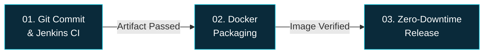

# Automated CI/CD Pipeline: Enterprise Java, Docker & Zero-Downtime

> **Status**: 🟢 ZERO-DOWNTIME

---

## Pipeline Overview

A three-stage automated CI/CD pipeline for enterprise Java applications, covering source control through production deployment with zero-downtime guarantees.



---

## Stage 1 — Git Commit & Jenkins CI

> 🏷️ **Gate**: Continuous Integration Gate

| Step | Description |
|------|-------------|
| **Trigger** | Single Git Push Trigger |
| **Webhook** | Automated Webhook Trigger — Jenkins listens for push events |
| **Build** | Maven Clean, Compile & Test — full build lifecycle |
| **Execution** | Deterministic Build Execution — reproducible outputs every time |

**Purpose**: Ensures every commit is automatically validated through compilation and testing before proceeding downstream. Acts as the quality gate for the entire pipeline.

---

## Stage 2 — Docker Packaging

> 🏷️ **Gate**: ✅ Artifact Integrity Verified

| Step | Description |
|------|-------------|
| **Build Strategy** | Multi-Stage Build — separates build-time and runtime dependencies |
| **Image Size** | Lightweight Container Images — minimal attack surface & fast pulls |
| **Tagging** | Immutable Tagging by SHA — every image is uniquely traceable to its commit |
| **Registry** | Automated Image Push to Registry — hands-free artifact publishing |

**Purpose**: Converts the validated build artifact into a production-ready, immutable Docker image. SHA-based tagging ensures full traceability from source to container.

---

## Stage 3 — Zero-Downtime Release

> 🏷️ **Result**: ⚡ 90% Faster Deployments

| Step | Description |
|------|-------------|
| **Strategy** | Rolling Traffic Cutover — gradual shift of live traffic to new version |
| **User Impact** | Zero End-User Disruption — no maintenance windows or error pages |
| **Efficiency** | 90% Manual Time Reduction — near-complete automation of release tasks |
| **Safety Net** | Instant Health Check Rollback — automatic revert on failure detection |

**Purpose**: Deploys the verified container image to production using a rolling update strategy, ensuring users experience no downtime while providing instant rollback capability.

---

## Key Metrics & Benefits

| Metric | Value |
|--------|-------|
| Deployment Speed | **90% faster** than manual deployments |
| User Disruption | **Zero** — seamless traffic cutover |
| Manual Intervention | **Reduced by 90%** |
| Rollback Time | **Instant** — automated health-check driven |
| Image Traceability | **100%** — immutable SHA tagging |
| Build Reproducibility | **Deterministic** — same input → same output |

---

## Pipeline Flow Summary

```
┌─────────────────────┐     ┌─────────────────────┐     ┌─────────────────────┐
│  01. SOURCE & CI    │────▶│  02. CONTAINERIZE   │────▶│  03. DEPLOY         │
│                     │     │                     │     │                     │
│  Git Push           │     │  Multi-Stage Build  │     │  Rolling Cutover    │
│  Webhook → Jenkins  │     │  Lightweight Images │     │  Zero Disruption    │
│  Maven Build & Test │     │  SHA Tagging        │     │  Health Checks      │
│  Deterministic      │     │  Registry Push      │     │  Instant Rollback   │
│                     │     │                     │     │                     │
│  ── CI Gate ──────  │     │  ── Verified ─────  │     │  ── 90% Faster ──  │
└─────────────────────┘     └─────────────────────┘     └─────────────────────┘
```

---

## External Links (from original)

| Action | Platform |
|--------|----------|
| 🎬 Watch CI/CD Video Demo | Video |
| 💼 Connect | **LinkedIn** |
| 📂 View Source Code | **GitHub** |

---

> [!TIP]
> This pipeline follows industry best practices: **commit → build → containerize → deploy** with quality gates at each stage, immutable artifacts, and automated rollback — the hallmarks of a mature DevOps workflow.
